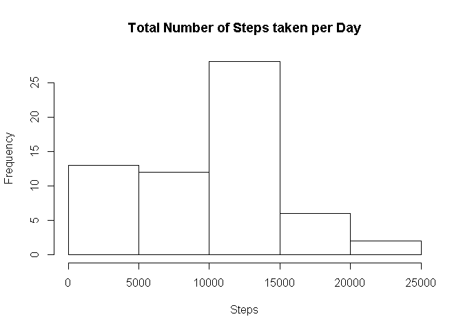

# Reproducible Research: Peer Assessment 1
gspinnada uhu  


## Loading and preprocessing the data
Unzipping & Loading data

```r
unzip("./activity.zip")
activity<-read.csv("./activity.csv")
```
Reclassing date as Date and steps as numeric

```r
activity$date<-as.Date(activity$date,"%Y-%m-%d")
activity$steps<-as.numeric(activity$steps)
```


## What is mean total number of steps taken per day?
1.  Calculating the total number of steps taken per day
    
    ```r
    totalsteps_day<-with(activity,tapply(steps,date,sum,na.rm=TRUE))
    ```
2.  Making a histogram of the total number of steps taken each day
    
    ```r
    hist(totalsteps_day,
      main="Total Number of Steps taken per Day",
      xlab="Steps")
    ```
    
    
3.  Calculating the mean and median of the total number of steps taken per day
  a) Mean
    
    ```r
    mean(totalsteps_day)
    ```
    
    ```
    ## [1] 9354.23
    ```
  b) Median
    
    ```r
    median(totalsteps_day)
    ```
    
    ```
    ## [1] 10395
    ```


## What is the average daily activity pattern?


## Imputing missing values


## Are there differences in activity patterns between weekdays and weekends?
