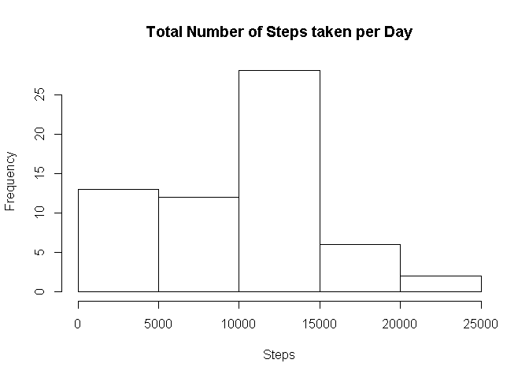
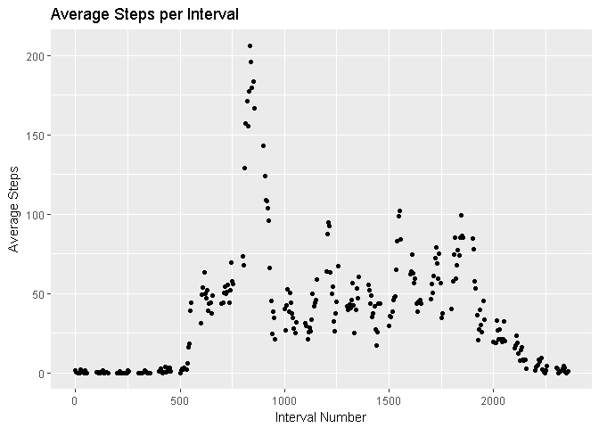
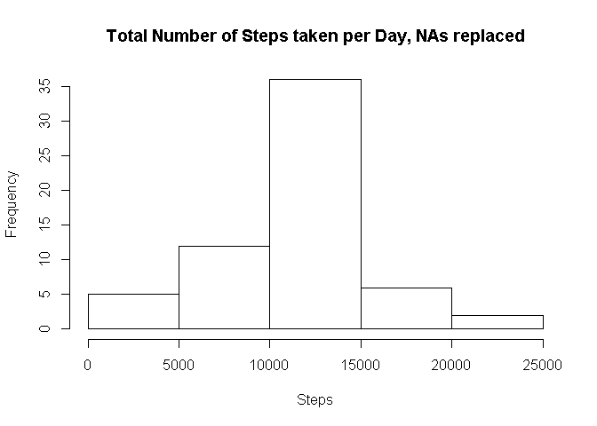
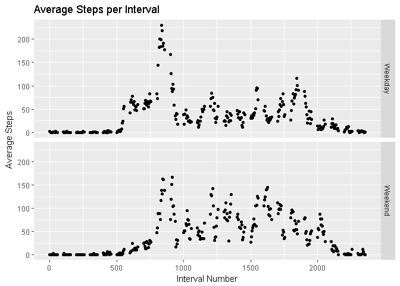

# Reproducible Research: Peer Assessment 1
gspinnada uhu  


## Loading and preprocessing the data
Unzipping & Loading data

```r
unzip("./activity.zip")
activity<-read.csv("./activity.csv")
```
Reclassing date as Date and steps as numeric

```r
activity$date<-as.Date(activity$date,"%Y-%m-%d")
activity$steps<-as.numeric(activity$steps)
```


## What is mean total number of steps taken per day?
1.  Calculating the total number of steps taken per day
    
    ```r
    totalsteps_day<-with(activity,tapply(steps,date,sum,na.rm=TRUE))
    ```
2.  Making a histogram of the total number of steps taken each day
    
    ```r
    hist(totalsteps_day,
      main="Total Number of Steps taken per Day",
      xlab="Steps")
    ```
    
    
3.  Calculating the mean and median of the total number of steps taken per day
  a) Mean
    
    ```r
    mean(totalsteps_day)
    ```
    
    ```
    ## [1] 9354.23
    ```
  b) Median
    
    ```r
    median(totalsteps_day)
    ```
    
    ```
    ## [1] 10395
    ```


## What is the average daily activity pattern?
1.  Time series plot of the 5-minute intervals in a day (x) vs the average number of steps taken per interval for all days (y)
  a) Calculating average number of steps per interval + creating dataframe with averages and interval numbers
    
    ```r
    mean_steps_int<-with(activity,tapply(steps,interval,mean,na.rm=TRUE))
    unique_int<-unique(activity$interval)
    unique_df<-data.frame(unique_int,mean_steps_int)
    names(unique_df)<-c("unique_int","mean_steps")
    ```
  b) Creating plot, using unique values in interval as x-axis and mean_steps_int as y
    
    ```r
    library(ggplot2)
    ggplot(data=unique_df,aes(x=unique_int,y=mean_steps))+
            geom_point()+
            labs(x="Interval Number",y="Average Steps",title="Average Steps per Interval")
    ```
    
    <!-- -->

2.  Which 5-minute interval, on average across all the days in the dataset, contains the maximum number of steps?
    
    ```r
    library(dplyr)
    ```
    
    ```
    ## 
    ## Attaching package: 'dplyr'
    ```
    
    ```
    ## The following objects are masked from 'package:stats':
    ## 
    ##     filter, lag
    ```
    
    ```
    ## The following objects are masked from 'package:base':
    ## 
    ##     intersect, setdiff, setequal, union
    ```
    
    ```r
    int_max_step_avg<-filter(unique_df,mean_steps==max(mean_steps))
    int_max_step_avg
    ```
    
    ```
    ##   unique_int mean_steps
    ## 1        835   206.1698
    ```
    Interval number 835 has the highest average number of steps - 206.1698113.

## Imputing missing values
1.  Counting the total number of NAs in steps; date & interval do not have NAs as they are descriptive and not measurements
    
    ```r
    length(activity$steps[is.na(activity$steps)==TRUE])
    ```
    
    ```
    ## [1] 2304
    ```
    There are 2304 rows containing missing values.
2.  Replacing NAs with mean for the respective 5minute interval in a new df activity_imputed.
    Looping through steps vector, replacing each NA value with matching interval's mean steps value from unique_df.
    
    ```r
    activity_imputed<-activity
    for (i in 1:length(activity_imputed$steps)){
            if (is.na(activity_imputed$steps[i])){
                    a<-activity_imputed$interval[i]
                    b<-match(a,unique_df$unique_int)
                    activity_imputed$steps[i]<-unique_df$mean_steps[b]
            }
    }
    ```
3.  See code for 2. above. Code creates activity_imputed df with NAs replaced using average steps per interval from df created in daily activity pattern section.
4.  Histogram of the total number of steps taken each day and reporting the mean and median total number of steps taken per day.
  a) Histogram of total steps per day including imputed values
    
    ```r
    totalsteps_day_rmNA<-with(activity_imputed,tapply(steps,date,sum,na.rm=TRUE))
    hist(totalsteps_day_rmNA,
      main="Total Number of Steps taken per Day, NAs replaced",
      xlab="Steps")
    ```
    
    
  b) Mean & Median of dataset with imputed values
    
    ```r
    answ<-c(mean(totalsteps_day_rmNA),median(totalsteps_day_rmNA))
    answ
    ```
    
    ```
    ## [1] 10766.19 10766.19
    ```
    The mean for the dataset with replaced NAs is 1.0766189\times 10^{4} compared to the original mean of 9354.2295082.
    The median for the dataset with replaced NAs is 1.0766189\times 10^{4} compared to the original mean of 1.0395\times 10^{4}.

## Are there differences in activity patterns between weekdays and weekends?
1.  Creating new factor variable "day" with 2 levels - "weekday" and "weekend" based on date
    
    ```r
    library(dplyr)
    activity_imputed<-mutate(activity_imputed,day=ifelse(weekdays(date) %in% c("Saturday","Sunday"),"Weekend","Weekday"))
    activity_imputed$day<-as.factor(activity_imputed$day)
    ```
2.  Panel plot with time series of 5 minute invervals vs average steps taken on weekdays vs weekend days
    
    ```r
    library(dplyr)
    activity_summary<-summarise(group_by(activity_imputed,interval,day),mean(steps))
    names(activity_summary)[3]<-"meansteps"
    library(ggplot2)
    ggplot(data=activity_summary,aes(x=interval,y=meansteps))+
            facet_grid(day~.)+
            geom_point()+
            labs(x="Interval Number",y="Average Steps",title="Average Steps per Interval")
    ```
    
    <!-- -->
